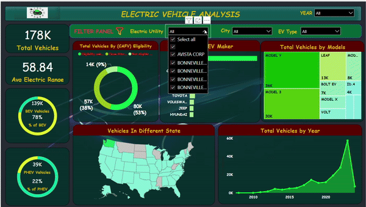

# Electric Vehicle Analysis Using PowerBI

## Problem Statements
#### KPI'S Requirements
1. Total Vehicles:
    - Understanding the overall landscape of electric vehicle, encompassing both BEV's and PHEVs, to assess the market size and growth.
2. Average Electric Rate:
    - Determine the average electric range of the electric vehiclein the dataset to gauge the technological advancements and efficiency of the EVs'
3. Total BEV Vehicle And % of Total BEV Vehicles:
    - Identify and analyze the the total number of Battery Electric Vehicle(BEVs) in the dataset.
    - Calculate the percentage of BEVs related to the total number of electric vehicle, providing insight into the dominance of fully electric vehicle.
4. Total PHEV Vehicle and % of Total PHEV Vehicle:
    -  Identify and analyze the the total number of Plug-in Hybrid Electric Vehicle(PLVs) in the dataset.
    - Calculate the percentage of PHVs related to total number of electric vehicles, offering insights into the market share og plug-in hybrid models.

#### Charts Requirement
1. Total Vehicles by Model Year
    - Visualization: Line/ Area Chart
    - Description: This chart will illustrate the distribution of electric vehicles over the years.
2. Total Vehicles by State 
    - Visualization: Map Chart
    - Description: This chart will showcase the geographical distribution of electric vehicles across different states, allowing for the identification of regions with higher adoption rates.
3. Top 10 Total Vehicle by Maker
    - Visualization: Bar chart
    - Description: Highlights the top 10 electric vehicle manufacturers based on the total number of of vehicles, providing insights into the market dominance of specific brands.
4. Total Vehicles by CAFV Eligibility
    - Visualization : Pie Chart or Donut Chart
    - Description: Illustrate the proportion of electric vehicles that are eligible for Clean Alternative Fuel Vehicle (CAFV) incentives, aiding in understanding the impact of incentives on vehicle adoption.
5. Top 10 Total Vehicles by Model:
    - Visualization : Tree Map
    - Description: Highlight the top 10 electric vehicle models based on the total number of vehicles, offering insights into consumer preferences and popular models in the market.